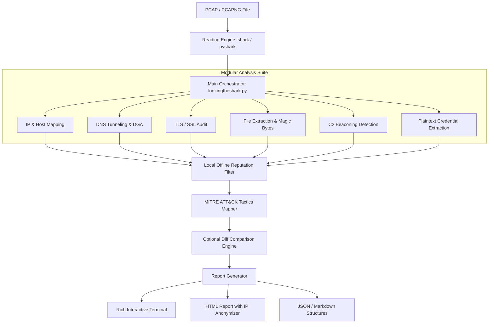

# LookingTheShark

**Forensic Network Capture Translator and Protocol Analysis Framework**

[](https://www.python.org/)
[](https://www.wireshark.org/)
[](https://attack.mitre.org/)
[](#)

</div>


---

## Overview

**LookingTheShark** is a network digital forensics (DFIR) analysis framework designed to automate the transformation of raw traffic captures (.pcap and .pcapng files) into structured, readable reports.

The tool reads network packets, reconstructs sessions, maps anomalous behavior against MITRE ATT&CK framework techniques, and provides a comparison (diff) engine to contrast baseline behavior captures against potential security incidents.

---

## Workflow and Capture Processing

The application processes network captures through a sequential pipeline backed by extraction tools and local engines:



---

## Key Features

*   **Modular Structured Analysis:** Integrates 12 independent modules to audit hosts, protocols, network layer behavior, and credentials.
*   **Advanced Network Heuristics:** Local algorithms to detect C2 beaconing patterns, domain generation algorithm (DGA) queries, and DNS tunneling techniques.
*   **Object Extraction and Signature Validation:** Extracts files embedded in TCP streams and validates discrepancies between their declared extension and the magic bytes of the header.
*   **MITRE ATT&CK Mapping:** Identifies suspicious behavior and directly associates it with attack tactic and technique identifiers.
*   **Change Detection (Diff Engine):** Compares two network captures to quickly and assertively isolate behavioral changes.
*   **Built-in Privacy:** Allows anonymizing the real IP addresses of the final report by replacing them with consistent aliases during export.

---

## System Requirements

*   **Environment:** Python 3.8 or higher.
*   **System Requirement:** **tshark (Wireshark)** must be installed and properly configured in the system's execution PATH.
*   **Python Dependencies:** Detailed in `requirements.txt` (includes `pyshark` and `rich` for terminal rendering).

---

## Installation and Deployment

### 1. Clone the repository
```bash
git clone https://github.com/nostraxiten/LookTheShark
cd LookTheShark
```

### 2. Install required dependencies
```bash
pip install -r requirements.txt
```

> [!IMPORTANT]
> Verify that running `tshark -v` responds correctly in your terminal before launching the application.

---

## Usage Guide

### Assisted Mode (Interactive)
Run the tool without arguments or invoking the menu to use the visual terminal interface:
```bash
python lookingtheshark.py
```
*This mode allows you to dynamically select the capture, analysis modules, and output formats.*

---

### Command Line Mode (Direct)

#### Full Analysis of a Capture File
```bash
python lookingtheshark.py --file malware.pcapng --modules ip_hosts,dns,tls,heuristics --deep --mitre --format html
```

#### Compare Two Captures (Baseline vs. Incident Mode)
```bash
python lookingtheshark.py --diff baseline.pcap incidente.pcap
```

---

### CLI Options Table

| CLI Argument | Type / Format | Description |
| :--- | :---: | :--- |
| `--file <path>` | Text | Network PCAP/PCAPNG file to analyze. |
| `--modules <list>` | Text | Modules to run, comma-separated. |
| `--deep` | Flag | Enables advanced search heuristics (Beaconing, DGA, Exfiltration). |
| `--mitre` | Flag | Associates findings with MITRE ATT&CK techniques. |
| `--anonymize` | Flag | Replaces IPs with aliases (e.g. Host-A, Host-B) in the report export. |
| `--format <format>` | Text | Report output formats (supports `md`, `json`, `html`). |
| `--diff <file1> <file2>` | Dual path | Performs a behavioral comparison between two captures. |
| `--whitelist-ips <path>` | File | Specifies a list of IPs to ignore during analysis heuristics. |

---

## Repository Structure

The framework follows a modular component organization:

```text
LookTheShark/
├── lookingtheshark.py           # Main application entrypoint
├── requirements.txt            # List of dependencies
├── README.md                   # General information document
├── modules/                    # Framework core and forensic modules
│   ├── __init__.py             # Datastruct definitions (Finding, etc.)
│   ├── ip_hosts.py             # Network host and IP analysis
│   ├── protocols.py            # Transport and application protocol breakdown
│   ├── dns_analysis.py         # DNS, DGA, and tunneling analysis
│   ├── file_extraction.py      # Object extractor and magic byte validation
│   ├── os_fingerprint.py       # Remote OS fingerprinting
│   ├── tls_analysis.py         # TLS session audit and analysis
│   ├── credentials_plain.py    # Plaintext password and data detector
│   ├── layer2_anomalies.py     # Layer 2 anomaly detection (ARP/MAC)
│   ├── behavior_heuristics.py  # Beaconing and interval algorithms
│   ├── reputation_offline.py   # Local reputation lookup
│   ├── mitre_mapping.py        # MITRE tactics mapper
│   ├── diff_engine.py          # Capture comparator (Diff)
│   └── report_builder.py       # Report file compiler
├── data/                       # Offline databases and reputation feeds
├── ui/                         # Terminal rendering classes (Rich)
├── templates/                  # Jinja2 rendering templates for HTML
└── tests/                      # Test PCAP captures
```

---

## Offline Reputation Lookups

To perform reputation validations without sending network packets externally, the `reputation_offline` module searches for plain text files with a `.txt` extension in the `data/reputation_feeds/` path.

> [!TIP]
> You can download public IOC feeds (such as Feodo Tracker's C2 IP lists) and place them in this folder for LookingTheShark to load them locally.

---

## Disclaimer

This framework is designed exclusively for digital forensic investigation, authorized audits, and defensive Blue Teaming activities. The author assumes no responsibility for malicious use, unauthorized network interception, or privacy violations committed by third parties using this code.
